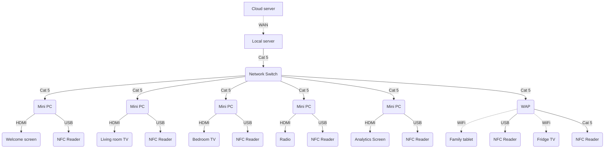

# Kantar Innovation Suite

These user guides should provide a comprehensive and clear guide to understand the makeup of the system, the

# Contents

[1. The system](#1)\
[2. Cloud server](#2)\
[3. Local server](#3)\
[4. Touch points](#4)\ 

# 1. The system 

The innovation suite system has been broken into several key touch points:

### Local network
- Welcome screen
- Living room TV
- Bedroom TV
- Family tablet
- Fridge TV
- Radio
- R&D screen
- Analytics screen

### Local network layout

### Cloud server
- Welcome page
- QR code pages

**Each of these touch points delivers interactive content to the users in the space.**
This content and the framework that it sits in can be accessed, edited and maintained via a combination of the local and cloud based systems.

---

The **Local** systems are stored and hosted on a server that sits in the innovation lab.
The **Cloud** systems are stored and hosted on a server that sits on 2Heads own cloud hosting service.

# 2. Cloud hosted server 

We use [Digital Ocean](www.digitalocean.com) to host our files, a platform that is widely used, well support, and secure.
We use the [Cloudways](www.cloudways.com) service to manage this server environment.

For access details, please contact:
**nickr@2heads.com
+44 7483 060 145**

# 3. Local server 

The local server sits in the cupboard underneath the kitchen counter.

**Model:**
Dell EMC PowerEdge T140 Xeon E-2124 / 3.3 GHz 8GB RAM Tower Server

**Login access:**
_User:_ admin
_Password:_ xxxx

## 3.1 File structure

. Root
├── Folder
├── Folder
├───└── File
├───└── File
├── Folder
├───└── Sub folder
├───────└── File

## 3.2 Remote Access

In situations where we need to fix bugs or edit files at short notice, we can use 2 different remote access options:

1. SSH (Secure Shell) access to the command line
	Step 1: xxx
	Step 2: xxx
	Step 3: xxx
	Step 4: xxx
	> **Note:** Restrictions? Things to remember?

2. Teamviewer remote desktop access
	Step 1: Download Teamviewer software from the [Teamviewer website](https://www.teamviewer.com/en/download)
	Step 2: xxx
	Step 3: xxx
	Step 4: xxx
	> **Note:** Restrictions? Things to remember?

# 4. Touch points 

A brief explanation of content and interaction for each of the key touchpoints in the upgraded innovation suite.

## 4.1 Welcome screen
Mounted outside the main suite on the wall in the corridor.

### 4.1.1 Contents

- Welcome page
-- Persona specific welcome messages
- Timeline graphic
-- Help page
- Coverage maps
- Feedback form
-- Privacy notice 

### 4.1.2 Updating pages
A version of the welcome screen minisite is stored locally on the server, and also in the cloud.

### 4.1.3 Collecting feedback
1. **Physical welcome screen**
All responses are stored on a local SQL database and also emailed to innovationlab@kantar.com
2. **Online welcome pages**
All responses are stored on a cloud based SQL database, and also emailed to innovationlab@kantar.com

## 4.3 Living room TV
Mounted above the fireplace. This screen is linked to a mini PC and NFC reader.

### 4.3.1 Contents

- Welcome page
-- Persona specific welcome messages
- Looping video content
--> QR Link to deep-dive web page online

### 4.3.2 Updating videos

All videos that run on this screen are 15-20s clips.
Using SSH access, it is possible to edit, delete and replace clips 

File location:
_local server/path/to/folder_

**Naming conventions**
The player searches for a specific naming convention for video clips to be recognised and played.

> Naming convention information

### 4.3.3 Updating content on the QR pages

This content is stored on the cloud server.

> Instructions on how to edit

## 4.4 Bedroom TV
Mounted on the chest of drawers in the bedroom. This screen is linked to a mini PC and NFC reader.

### 4.4.1 Contents

- Welcome page
-- Persona specific welcome messages
- Looping video content
--> QR Link to deep-dive web page online

### 4.4.2 Updating videos

All videos that run on this screen are 15-20s clips.
Using SSH access, it is possible to edit, delete and replace clips 

File location:
_local server/path/to/folder_

**Naming conventions**
The player searches for a specific naming convention for video clips to be recognised and played.

> Naming convention information

### 4.4.3 Updating content on the QR pages

This content is stored on the cloud server.

> Instructions on how to edit

## 4.5 Family tablet
Placed on the bedside table. This device is connected to the wireless access point (WAP) and IP NFC reader.

### 4.5.1 Contents

- Welcome page
-- Persona specific welcome messages
- Looping video content
--> QR Link to deep-dive web page online

### 4.5.2 Updating videos

All videos that run on this screen are 15-20s clips.
Using SSH access, it is possible to edit, delete and replace clips 

File location:
_local server/path/to/folder_

**Naming conventions**
The player searches for a specific naming convention for video clips to be recognised and played.

> Naming convention information

### 4.5.3 Updating content on the QR pages

This content is stored on the cloud server.

> Instructions on how to edit

## 4.6 Fridge screen
The fridge has a built in screen. We play content using the built in Samsung Tizen browser. This device is connected to the wireless access point (WAP) and IP NFC reader.

### 4.6.1 Contents

- Welcome page
-- Persona specific welcome messages
- Looping video content
--> QR Link to deep-dive web page online

### 4.6.2 Updating videos

All videos that run on this screen are 15-20s clips.
Using SSH access, it is possible to edit, delete and replace clips 

File location:
_local server/path/to/folder_

**Naming conventions**
The player searches for a specific naming convention for video clips to be recognised and played.

> Naming convention information

### 4.6.3 Updating content on the QR pages

This content is stored on the cloud server.

> Instructions on how to edit

### 4.6.4 General admin

#### Startup
The Fridge is always on.
> Instructions on how to turn on?

#### Loading the content page
Step 1: Wake the screen up by tapping it
Step 2: Tap the browser shortcut icon
Step 3: The Kantar content page is bookmarked
Step 4: To hide the url bar, swipe up/down on screen

## 4.7 Fridge screen
The fridge has a built in screen. We play content using the built in Samsung Tizen browser. This device is connected to the wireless access point (WAP) and IP NFC reader.

### 4.7.1 Contents

- Welcome page
-- Persona specific welcome messages
- Looping video content
--> QR Link to deep-dive web page online

### 4.7.2 Updating videos

All videos that run on this screen are 15-20s clips.
Using SSH access, it is possible to edit, delete and replace clips 

File location:
_local server/path/to/folder_

**Naming conventions**
The player searches for a specific naming convention for video clips to be recognised and played.

> Naming convention information

### 4.7.3 Updating content on the QR pages

This content is stored on the cloud server.

> Instructions on how to edit

### 4.7.4 General admin

#### Startup
The Fridge is always on.
> Instructions on how to turn on?

#### Loading the content page
Step 1: Wake the screen up by tapping it
Step 2: Tap the browser shortcut icon
Step 3: The Kantar content page is bookmarked
Step 4: To hide the url bar, swipe up/down on screen

### 4.7.5 Maintenance

**Issue 1:** The page doesn't load on the fridge when the system is started up
1. Swipe down to reveal the fridge tools
2. Tap the WiFi icon twice to turn it off and on
3. Reload the page
4. Swipe up on the screen to hide the menu bars

**Issue 2:** The screen is zoomed in so the text is not all visible and/or cropped
1. Pinch and swipe on the page to zoom out fully
2. Swipe up on the screen to hide the menu bars

## 4.8 Radio

### 4.8.1 Contents

- Welcome track
-- Persona specific welcome messages
- Looping audio content
--> Physical QR Link to deep-dive web page online

### 4.8.2 Updating audio

All audio clips that run on this device are clips.
Using SSH access, it is possible to edit, delete and replace clips 

File location:
_local server/path/to/folder_

**Naming conventions**
The player searches for a specific naming convention for audio clips to be recognised and played.

> Naming convention information

### 4.8.3 Updating content on the QR pages

This content is stored on the local server.

> Instructions on how to edit

### 4.8.4 Maintenance

**Issue 1:** The page doesn't load on the fridge when the system is started up
1. Swipe down to reveal the fridge tools
2. Tap the WiFi icon twice to turn it off and on
3. Reload the page
4. Swipe up on the screen to hide the menu bars

### 4.8.4 General admin

#### Startup
> Instructions on how to turn on?

#### Shutdown
If the Mini PC that is connected to the radio is turned off while the radio is connected with the aux cable and in AUX mode, you may hear a feedback/static noise.
**Solution:** Make sure to turn off the radio before you turn off the Mini PC that runs it in order to avoid audio feedback issues.

## 4.9 R&D Screen

### 4.9.1 Contents
This screen sits on the kitchen counter in the corner of the room.

# 5. Lighting control
The space is equipped with a combination of smart light switches and Philips Hue smart bulbs.
The switches control lighting in each zone of the innovation suite (living room, bedroom, kitchen, dining room).

## 5.1 Control tablet 
There are buttons on the control tablet to control each area within the innovation suite:
- Toggle living room lights on/off
- Toggle bedroom lights on/off
- Toggle kitchen lights on/off
- Toggle dining room lights on/off
- Turn all lights off
- Turn all light on

## 5.2 Maintenance
> **Issue 1:** If users press a physical light switch to turn lighting on or off, it can take between 5-10s for the buttons to update their status on the presenter control tablet.

> **Issue 2:** xxx

# 5. Presenter tablet
The space is equipped with a combination of smart light switches and Philips Hue smart bulbs.
The switches control lighting in each zone of the innovation suite (living room, bedroom, kitchen, dining room).

## 5.1 Clear data 
This button resets the session so that all viewer data resets to zero.

## 5.2 Power off
This button starts the shutdown pocedure on all mini PCs.

This should be used at the end of the day, when no more sessions are planned.

## 5.3 Power on
This button resets the smart switches, which triggers a startup sequence on all the mini PCs.

This function should be used at the start of the day to turn all the Mini PCs on and make the innovation suite ready for groups to use.

## 5.4 Maintenance
> **Note:** If a screen displays incorrectly, or not at all, and the monitor is turned on, then usually pressing **power off**, waiting 30s, and then pressing **power on**, and waiting for 30s should fix the issue.
